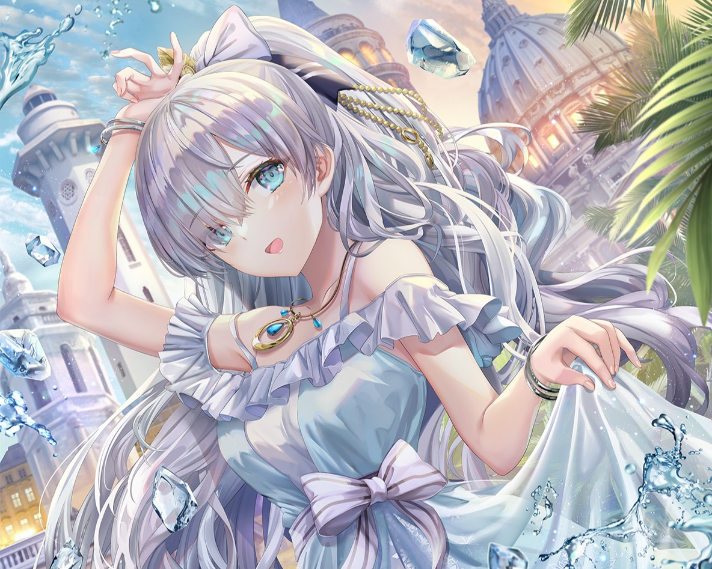
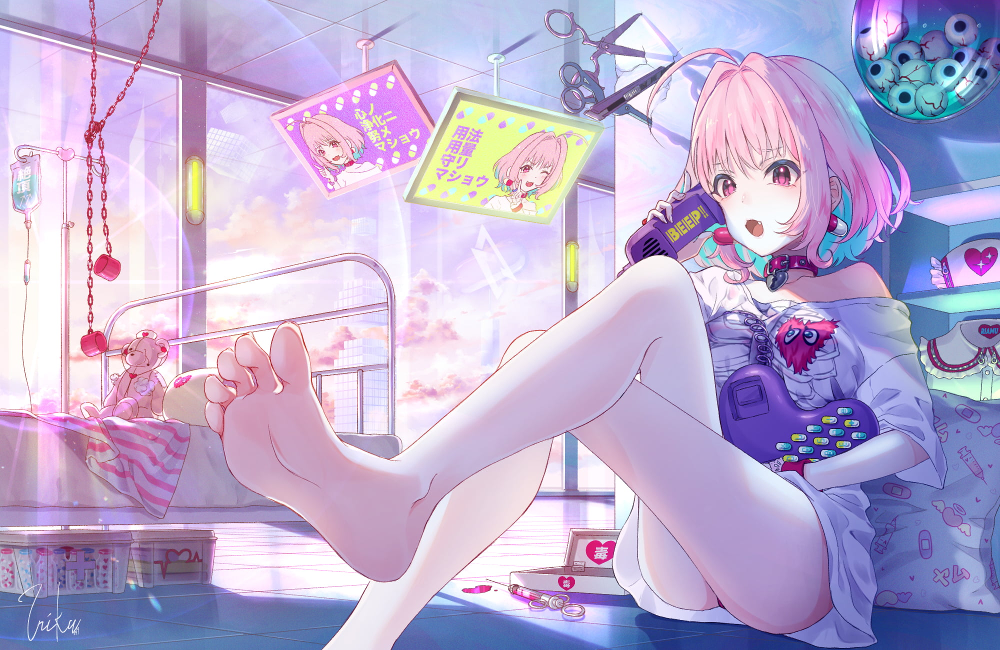

# Hi there, I'm Uruha Nagamiya[ウルア  ナガミーヤ]

 

[)](https://https://twitter.com/UNagamiya)

- 🌱 I’m currently learning Spring Framework
- ⚡ My Real Name Is Mahbub Ulhaq

### Connect with me:

&nbsp;&nbsp;

&nbsp;&nbsp;

&nbsp;&nbsp;

### Languages and Tools:

 
 

---
  
  

  
  
  
  
  
  
  ### Favourite Waifu:
  Nekoha Shizuku
 
  Hatsune Miku
.png)
  Uruha Rushia
.jpg) 
  Riamu Yumemi

  
[website]: https://ulhaq.web.id
[facebook]: https://www.facebook.com/mahbub.ulhaq.1610
[twitter]: https://twitter.com/UNagamiya
[instagram]: https://www.instagram.com/uruhanagamiya
